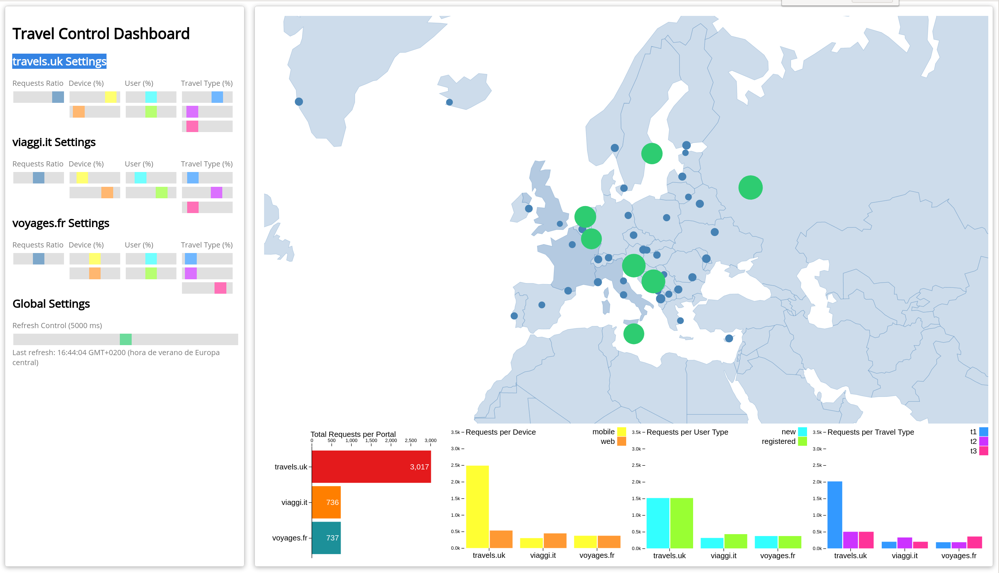

= OpenShift Service Mesh - Heading to Production Lab Instructions
:toc:

== Lab Prerequisites

For this lab you will need the following *CLI tools*. Please have them installed and configured before you get started with any of the scenarios.

* OpenShift CLI: https://docs.openshift.com/container-platform/4.12/cli_reference/openshift_cli/getting-started-cli.html#installing-openshift-cli[https://docs.openshift.com/container-platform/4.12/cli_reference/openshift_cli/getting-started-cli.html#installing-openshift-cli]
* Git: https://git-scm.com/downloads[https://git-scm.com/downloads]
* curl: https://curl.se/download.html[https://curl.se/download.html]
* OpenSSL: https://www.openssl.org/source/[https://www.openssl.org/source/]

== Download the Lab Sources

Before we start, let’s clone the Lab sources and set the LAB_HOME environment variable to point to the root directory of this Lab:

[source,shell]
----
git clone https://github.com/skoussou/rhte-ossm-labs rhte-ossm-labs

export LAB_HOME="$(pwd)/rhte-ossm-labs"

cd rhte-ossm-labs
----

== Use of correct Openshift Namespaces via *LAB_PARTICIPANT_ID*

[IMPORTANT]
====
As we will be using a shared cluster and the Service Mesh users are also common with access to multiple namespaces it is very important each participant uses their allocated namespaces. In order to make use of the correct *namespaces* note your link:https://github.com/skoussou/rhte-ossm-labs#lab-information[*LAB_PARTICIPANT_ID* which you can find in this table]

*eg.* This is an example ONLY for user who has been assigned *LAB_PARTICIPANT_ID=1*
====

== Introduction

Throughout the following labs we will use a Fictive Use Case of a Travel Agency company introducing a Service Mesh for their existing applications and heading to production. Lets walk through the use case:

== Understanding the existing application

(Note: The sample application we use in this Lab is the _Kiali Travel Demo Tutorial_: https://kiali.io/docs/tutorials/travels/[https://kiali.io/docs/tutorials/travels/])

=== Travel Portal Domain namespace

The Travel Demo application simulates two business domains organized in different namespaces.
In a first namespace called `travel-portal` there will be deployed several travel shops, where users can search for and book flights, hotels, cars or insurance. The shop applications can behave differently based on request characteristics like channel (web or mobile) or user (new or existing). +
These workloads may generate different types of traffic to imitate different real scenarios. All the portals consume a service called `travels` deployed in the `travel-agency` namespace.

=== Travel Agency Services Domain namespace

A second namespace called `travel-agency` will host a set of services created to provide quotes for travel. +
A main `travels` service will be the business entry point for the travel agency. It receives a destination city and a user as parameters and it calculates all elements that compose a travel budget: airfare, lodging, car reservation and travel insurance. +
Each service can provide an independent quote and the `travels` service must then aggregate them into a single response. Additionally, some users, like _registered_ users, can have access to special discounts, managed as well by an external service. +
Service relations between namespaces can be described in the following diagram:

=== Travel Portal and Travel Agency flow

A typical flow consists of the following steps:

. A portal queries the `travels` service for available destinations,
. `travels` service queries the available `hotels` and returns to the portal shop,
. A user selects a destination and a type of travel, which may include a `flight` and/or a `car`, `hotel` and `insurance`,
.  `Cars`, `Hotels` and `Flights` may have available discounts depending on user type.

=== Travel Control namespace

The `travel-control` namespace runs a _business dashboard_ with two key features:

* Allow setting changes for every travel shop simulator (traffic ratio, device, user and type of travel).
* Provide a _business_ view of the total requests generated from the `travel-portal` namespace to the `travel-agency` services, organized by business criteria as grouped per shop, per type of traffic and per city.

== Next Steps
link:scenario-1.adoc[Getting started with Scenario 1]