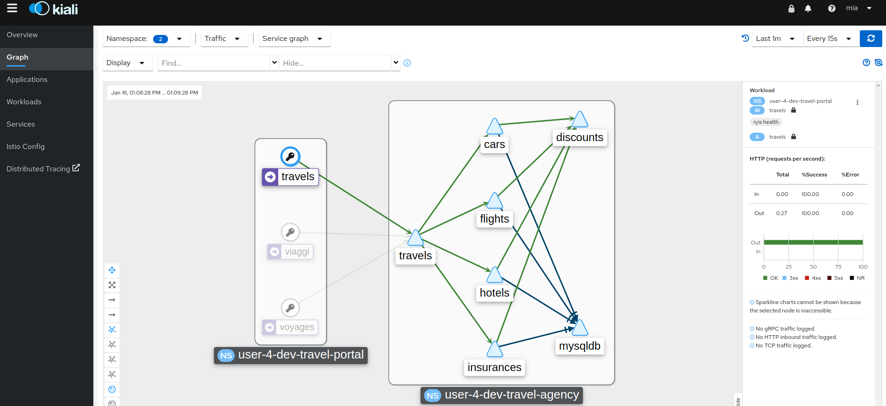

= Scenario 2 - Service Mesh Development Environment & Observability Stack
:toc:

The Travel Agency company has decided to setup a development as well as a production environment for the Travel Demo application.

In this lab scenario you wil look at the development environment in two parts:

1. _The first_ part of the scenario (already pre-delivered) is setting up the development environment, creating the users, roles and rolebindings as well as installing the Service Mesh in the DEV environment.
2. _The second part_ of the scenario is about verifying that everything has been correctly installed, familiarize with the Service Mesh observability stack and ensure all roles/permissions are working as expected.

== User credentials
[cols="5,5"]
.Users credentials
|===
|username |password

| emma | emma

| cristina | cristina

| farid | farid

| john | john

| mia | mia

| mus | mus

|===

== Part I: Installing the Development environment

[IMPORTANT]
====
*You do not have to execute anything in this part of the lab* as lab instructors have *pre-setup all the required assets for the Travel Agency development environment*, including users, roles, namespaces, apps, service mesh etc. You will create the PROD environment step-by-step in the next scenario. You can inspect at the end of the lab the installation of the development environment by exploring the link:../setup/run-setup-scenario-1.sh[Install Script]
====

Reading the following is totally optional and you are urged to move to _Part II_ as soon as possible as we briefly, below, describe the steps the link:https://github.com/skoussou/rhte-ossm-labs/blob/main/lab-instructions/scenario-1.adoc#userrolepersona-mapping-for-the-dev-environment[_Travel Agency Enterprise Personas_] would have had to follow in order to deliver such a development environment:

=== Actions with role Cluster Admin

1. As openshift administrator (role: `Cluster Admin`) add the `Service Mesh` operators in the OCP Cluster
2. As openshift administrator (role: `Cluster Admin`) once the operators have been successfully installed, create the necessary _Travel Agency_ Namespaces
3. As openshift administrator (role: `Cluster Admin`) create the `Service Mesh Roles`
4. As openshift administrator (role: `Cluster Admin`) create the Service Mesh Users and assign Roles

=== Actions with role Mesh Operator

1. As *emma* (role: `Mesh Operator`) create the `Service Mesh` controlplane namespaces and the `ServiceMeshControlPlane (SMCP)` resource.

=== Actions with role Mesh Developer

1. As *farid* (role: `Mesh Developer`) _Travel Services Domain Owner (Tech Lead)_
** Onboard namespace `dev-travel-agency` to Service Mesh `dev-basic` by adding a `ServiceMeshMember` (`SMM`) resource in `dev-travel-agency`.
** Deploy the Applications in `dev-travel-agency` namespaces

2. As *cristina* (role: `Mesh Developer`) _Travel Portal Domain Owner (Tech Lead)_
** Onboard namespaces `dev-travel-control` and `dev-travel-portal` to Service Mesh `dev-basic` by adding a `ServiceMeshMember` (`SMM`) resource in each namespace for `dev-basic` membership.
** Deploy the Applications in `dev-travel-control`, `dev-travel-portal` namespaces and `Istio` configs to expose Service Mesh services.

=== Final Actions with role Mesh Operator

1. As *emma* (role: `Mesh Operator`) create the Istio `Gateway` resource

IMPORTANT: `OSSM` -like Istio- now offers the ability for the injection of an  *_ingress Gateway_* in the dataplane however for the _Travel Agency_ use case the Architects have selected a *_Self-Service(Restricted)_*  link:https://github.com/skoussou/rhte-ossm-labs/blob/main/lab-instructions/scenario-1.adoc#user-governance-model[Model of Operation] where the `Mesh Operator` will be responsible for ingress/egress resource configurations.

== Part II:  Development Environment Verification & Observability Usage

[IMPORTANT]
====
First export the following in the terminal of your choice (see link:../README.adoc[Lab Information] for values)

* export CLUSTER_CONSOLE=https://console-openshift-console.apps.<CLUSTER_NAME>.<DOMAIN_NAME>/
* export CLUSTER_API=https://api.<CLUSTER_NAME>.<DOMAIN_NAME>:6443/
* export LAB_PARTICIPANT_ID=<FROM 2nd column of THE TABLE below `userx`>
* export OCP_DOMAIN=apps.<CLUSTER_NAME>.<DOMAIN_NAME>
* export SSO_CLIENT_SECRET=bcd06d5bdd1dbaaf81853d10a66aeb989a38dd51
====

=== Task 1: Access the Travel Control Dashboard
* Log in via CLI with user `emma` who has access to `$LAB_PARTICIPANT_ID-dev-istio-system` and get the URL to the application business dashboard. Paste the URL in a Browser to verify that you can reach the *Travel Control Dashboard* .

[source, shell]
----
./lab-3/login-as.sh emma
echo "http://$(oc get route istio-ingressgateway -o jsonpath='{.spec.host}' -n $LAB_PARTICIPANT_ID-dev-istio-system)"
----

* The result should look like

image::assets/01-travels-dashboard.png[]

=== Task 2: Access the Observability Stack

In this task you will learn how you can find the URLs to the Observability Stack components of the Service Mesh.

* Logged in via CLI (we have used user `cristina`/`cristina`) execute the following to retrieve the URLs of the `OSSM` Observability Stack (`Kiali`, `Jaeger`, `Prometheus`, `Grafana`) components. Open the links on a browser and use the preceeding `cristina`'s credentials to login.

[source, shell]
----
./lab-3/login-as.sh cristina
echo "http://$(oc get route kiali -o jsonpath='{.spec.host}' -n $LAB_PARTICIPANT_ID-dev-istio-system)"
echo "https://$(oc get route jaeger -o jsonpath='{.spec.host}' -n $LAB_PARTICIPANT_ID-dev-istio-system)"
echo "https://$(oc get route prometheus -o jsonpath='{.spec.host}' -n $LAB_PARTICIPANT_ID-dev-istio-system)"
echo "https://$(oc get route grafana -o jsonpath='{.spec.host}' -n $LAB_PARTICIPANT_ID-dev-istio-system)"
----

* An alternate method to access some of the components is once you have logged into `Kiali` you can access the `Grafana` and `Jaeger` URLs by clicking on *?* next to your name (top-right KIALI corner), then *About* and you should have the URLs presented.

image::./assets/02-about.png[200,200]

=== Task 3: Test the Observability stack as Product Owner for the Travel-Agency Solution

Access the `Kiali` URL and login with username/password *`mus`*/*`mus`* (role: `Application Viewer`)

As the `Product Owner` you have *view* access to all 3 _data plane_ namespaces and the _control plane_ namespace.

You are allowed to:

1. See traces for the overall solution. From the `Kiali` menu on the left go to `Distributed Tracing` and login with your credentials (`mus/mus`) to view the tracing console
2. See metrics for the overall solution. Go to `Workloads` in `Kiali` and select `cars-v1` application workload. Use the `inbound` or `outbound` metrics.
+

+

3. *Alternatively*, go to the `Prometheus` URL (identified above) and login with your credentials (*`mus`*/*`mus`*). Apply on the `Graph` view ONE of the following metrics:
*** `istio_requests_total{destination_workload="discounts-v1", app="discounts"}` to visualize requests towards `discounts-v1`
*** `istio_request_duration_milliseconds_count{app="discounts"}`
*** `istio_response_bytes_bucket`
4. See the dashboards in grafana for the solution. Access the `Grafana` URL log with credentials *`mus`*/*`mus`* (role: `Application Viewer`, See above on how to find the URL)
*** Check the 'status' of the overall Travel Agency solution *Dashboards -> Manage -> Istio -> Istio Mesh Dashboard*
+

*** Check the 'performance' of the overall Travel Agency solution *Dashboards -> Manage -> Istio -> Istio Performance Dashboard*
+
image::./assets/02-grafana-performance.png[400,1000]

==== Verifying that RBAC restrictions for the `Product Owner` are in place
[WARNING]
====
As `Product Owner` You are not allowed to modify the Istio Configurations and view the Istio logs
====

* You should not be able to modify configs via `Kiali` as user *`mus`*. If you select in the menu to the left `Istio Config`, select from the top drop-down namespace `userx-istio-system`, filter by _Istio Type_ `Gateway` and enter the `control-gateway` config you will notice the config cannot be modified by the user.
+
image::./assets/02-mus-view-config.png[400,800]

* In Kiali as *`mus`* you cannot access the logs of any workload, neither for `istio-proxy` nor for the main workload container. In the menu, to the left, go to `Workloads`, click on `cars-v1` workload, and go to tab logs, none are displayed. Instead a similar message to the following is displayed
+
`Failed to fetch workload logs: pods "cars-v1-7b85d9b99b-l4hjg" is forbidden: User "mus" cannot get resource "pods/log" in API group "" in the namespace "userx-dev-travel-agency"`

=== Task 4: Test the Observability stack as an App/Domain Owner for the Travel-Portal or Travel-Services Domain

1. Access `Kiali` URL with username/password *`farid`*/*`farid`* (role: `Mesh Developer`)

* As the `Domain Owner` of the _Travel Services_ domain you have *view* access to
** _data plane_ namespace `dev-travel-agency` and the
** _control plane_ `$LAB_PARTICIPANT_ID-dev-istio-system` namespace.
+

* You are also allowed to:
2. See traces for the overall solution. From `Kiali` menu, in the left, go to `Distributed Tracing` and login with your credentials to view the tracing console.
+

3. See metrics. Go to `Prometheus` URL (identified above) and login with your credentials. Apply on the `Graph` view the appropriate metrics required (eg. `istio_request_duration_milliseconds_count{app="hotels"}`).
+

4. See logs for the workloads in your domain. From the `Kiali` menu on the left go to `Workloads` and access one of the workloads, the tab `Logs` has both proxy and pod logs available
+

+
5. See and modify Istio Configs for your domain. From the `Kiali` menu, in the left, go to `Istio Config`.
** As *`farid`*/*`farid`* you will be able to see in `$LAB_PARTICIPANT_ID-dev-istio-system` the configs but if you try to modify them you will not be able to as you don't have _write_ access in that namespace.
+

+
** If you login in `Kiali` as *`cristina`*/*`cristina`* you should be able to access the configs for the control `VirtualService` and `DestinationRule` in `$LAB_PARTICIPANT_ID-dev-travel-control` and apply some modification as those namespaces are part of your domain (*Warning:* Don't save any changes).
+

+

6. Optionally (skip to save time) see Grafana Dashboards (See above on how to find the URL)
*** Check the 'status' of the services and workloads in the `dev-travel-portal` or `dev-travel-agency` by viewing
*** *Dashboards -> Manage-> Istio -> Istio Service Dashboard* dashboard
+
image::./assets/02-grafana-cars-istio-service-dashboard.png[400,1000]

*** *Dashboards -> Manage-> Istio -> Istio Workloads Dashboard*  dashboards
+

=== Task 5: Test the Observability stack as Developer for the Travel-Portal or Travel-Services Domain

1. Access `Kiali` URL with username/password *`mia`*/*`mia`* (role: `Application Viewer`)

* As a `Developer` for the _Travel Services_ domain *mia* is interested in viewing functional, performance or configuration issues with the workloads in the `dev-travel-agency`. Therefore, access is given to that service mesh namespace while the _Travel Portal_ domain namespaces and the service mesh control plane namespace are restricted (padlock icon).
+

=== Task 6: Test the Observability stack as Mesh Operator

1. Access `Kiali` URL as with username/password *`emma`*/*`emma`* (role: `Mesh Operator`)

* As the `Mesh Operator` you have *full* access to all 3 _data plane_ namespaces and the _control plane_.
** In `Kiali` go to *Graphs -> App Graph*, select from *Display* `Request Distribution`, `Namespace Boxes`, `Traffic Animation`, `Security` and see the Mesh Operator view
** In addition from the `Kiali` menu on the left to go to `Istio Config`. You should be able to access or modify any config as the administrator of this mesh
** You can in addition access logs of the workloads. From the `Kiali` menu on the left go to `Workloads` and access one of the workloads, it has both proxy and pod logs available
** Finally, you can like the previous users access `prometheus`, `jaeger` and `grafana`. On the latter there is a dashboard to visualize the state of the service mesh _control plane_
*** *Dashboards -> Manage-> Istio -> Istio Control Plane Dashboard*  dashboards

== Next Steps

Congratulations! You have completed Scenario 2.
Now that we have verified the Development environment with the different users and roles, we'll proceed to install the production environment.

link:scenario-3.adoc[Getting started with Scenario 3]
