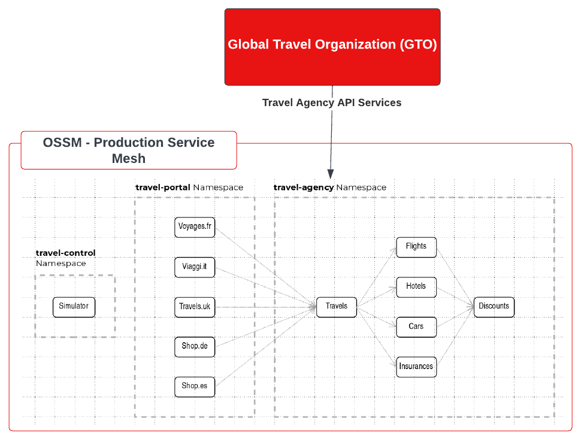
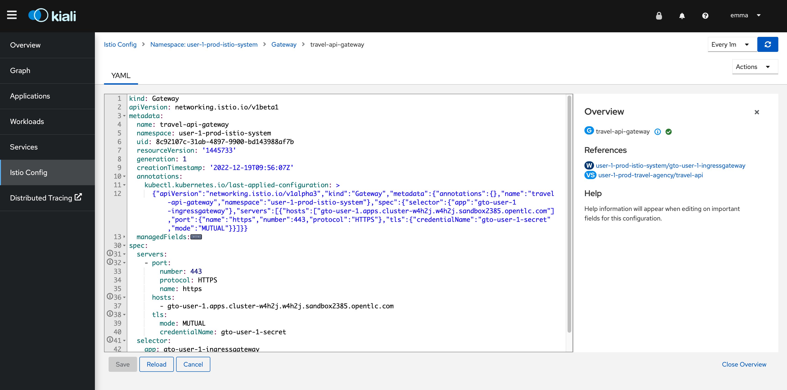
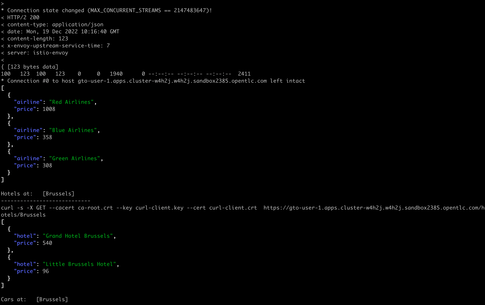
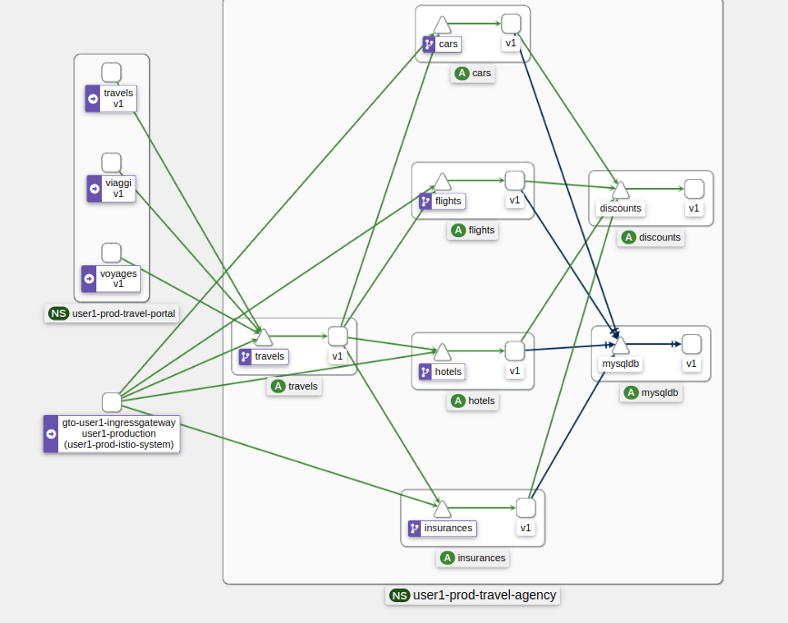
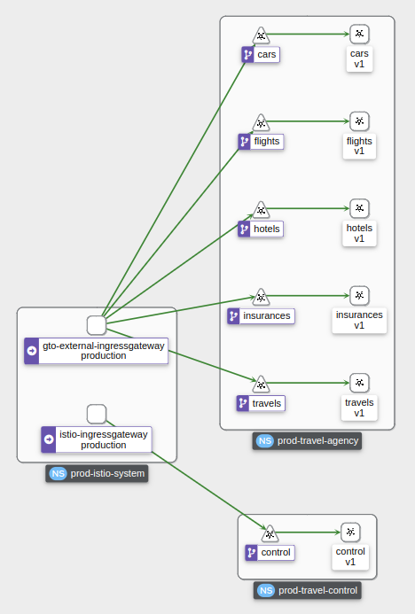

= Scenario 4 - Securing (Authn & Authz) Gateways with MTLS and valid JWT Token
:toc:

[IMPORTANT]
====
Before moving forward you should have fully completed *Lab Scenario-3*. If you have not done so, please do so now using if preferred the script `lab-3/complete-lab-3.sh`.
====

The Travel Agency company have their applications now running in a development and production environment and within Openshift Service Mesh. Now there is a new business opportunity for the Travel Agency, as a new Business partner wants to integrate the Travel API services with their own Solutions. The Travel Agency company needs to establish a secure way to expose the API Services for external partners.

== Requirements and constraints on integrating the new Business Partner

1. The new partner _Global Travel Organization(GTO)_ will source travel offers via _Travel Services Domain_ APIs.
2. The Travel Agency _Security Team_ requires all communications with the external client to be performed over `MUTUAL TLS`.
3. The Travel Agency _Platform Team_ wishes to enable further `authentication` with a valid JWT token in order to exercise possible `authorization` policies in the future.

== Task 1: Export Environment variables

[IMPORTANT]
====
As this is a multi-tenant cluster you should restrict use for this lab to the following namespaces associated with your user *`$LAB_PARTICIPANT_ID-prod-istio-system`*, *`$LAB_PARTICIPANT_ID-prod-travel-control`*, *`$LAB_PARTICIPANT_ID-prod-travel-portal`*, *`$LAB_PARTICIPANT_ID-prod-travel-agency`*

Export the following in the terminal of your choice (see link:../README.adoc[Lab Information] for values)

* export CLUSTER_CONSOLE=https://console-openshift-console.apps.<CLUSTER_NAME>.<DOMAIN_NAME>/
* export CLUSTER_API=https://api.<CLUSTER_NAME>.<DOMAIN_NAME>:6443/
* export LAB_PARTICIPANT_ID=<FROM 2nd column of THE TABLE below `userx`>
* export OCP_DOMAIN=apps.<CLUSTER_NAME>.<DOMAIN_NAME>
* export SSO_CLIENT_SECRET=bcd06d5bdd1dbaaf81853d10a66aeb989a38dd51
====

[NOTE]
====
If you are running out of time and wish to complete the following lab sections in a single step execute
----
cd lab-4
./complete-lab-4.sh $SSO_CLIENT_SECRET $OCP_DOMAIN $LAB_PARTICIPANT_ID
----
====

== Task 2: External API integration with mTLS

In this task we are going to create:

* An additional ingress gateway for the Travel Agency API Services
* An Istio `VirtualService` configuration for traffic to flow via the gto gateway
* Certificates for our `curl` GTO client to connect with MTLS to the gto gateway
* Verify the MTLS connection

=== Step 1 - Create additionalIngress Gateway in SMCP

Login as Mesh Operator (credentials `emma/emma`) and modify the SMCP resource. You can also do this from within the Openshift Console.

[source, shell]
----
cd lab-4
./login-as.sh emma
oc edit smcp/$LAB_PARTICIPANT_ID-production -n $LAB_PARTICIPANT_ID-prod-istio-system
----

Navigate to the gateway section and add an additional gateway as follows:

====
  gateways:
    additionalIngress:
      gto-$LAB_PARTICIPANT_ID-ingressgateway:
        enabled: true
        runtime:
          deployment:
            autoScaling:
              enabled: false
        service:
          metadata:
            labels:
              app: gto-$LAB_PARTICIPANT_ID-ingressgateway
          selector:
            app: gto-$LAB_PARTICIPANT_ID-ingressgateway
====

You can verify the creation of the additional gateway either in the OCP Console or with the CLI:

[source, shell]
----
$ oc get pods -n $LAB_PARTICIPANT_ID-prod-istio-system |grep gto
gto-user1-ingressgateway-5c87989fb7-r9grv

$ oc get routes -n $LAB_PARTICIPANT_ID-prod-istio-system |grep "ingress"
gto-user1-ingressgateway   gto-user1-ingressgateway-user1-prod-istio-system.apps.cluster-xvsnq.sandbox2004.opentlc.com          gto-user1-ingressgateway        8080                               None
----

=== Step 2 - Expose and secure via MTLS host on new Gateway

In the next step you will expose the new `Gateway` and in order to do this the script provided will:

* create the CA and certs for the exposure of the TLS based `Gateway`,
* an Openshift passthrough route,
* the Istio `Gateway` configuration
* create the client certificates based on the same CA for the curl client (in order to test MTLS):

[source, shell]
----
./create-external-mtls-https-ingress-gateway.sh prod-istio-system $OCP_DOMAIN $LAB_PARTICIPANT_ID
----

You can check the created certs by looking in your current directory:

[source, shell]
----
ls -ltr

-rw-r--r--@ 1 oschneid  staff  3272 Dec 19 11:04 ca-root.key
-rw-r--r--@ 1 oschneid  staff  1944 Dec 19 11:04 ca-root.crt
-rw-r--r--@ 1 oschneid  staff   523 Dec 19 11:04 gto-user1.conf
-rw-r--r--@ 1 oschneid  staff  1704 Dec 19 11:04 gto-user1-app.key
-rw-r--r--@ 1 oschneid  staff  1045 Dec 19 11:04 gto-user1-app.csr
-rw-r--r--@ 1 oschneid  staff    17 Dec 19 11:04 ca-root.srl
-rw-r--r--@ 1 oschneid  staff  1614 Dec 19 11:04 gto-user1-app.crt
-rw-r--r--@ 1 oschneid  staff  1704 Dec 19 11:04 curl-client.key
-rw-r--r--@ 1 oschneid  staff   940 Dec 19 11:04 curl-client.csr
-rw-r--r--@ 1 oschneid  staff  1497 Dec 19 11:04 curl-client.crt
----

To verify what has been applied you can navigate in Kiali to `Istio Config` and check the `travel-api-gateway` resource.

=== Step 3 - Configuration to allow Traffic flow via new Gateway

As the Travel Services Domain Owner (Tech Lead) you can now enable Istio routing to your services via the new gateway (previously only possible via `$LAB_PARTICIPANT_ID-prod-travel-portal` namespace). Login with credentials `farid/farid` and deploy the Istio Configs in your `$LAB_PARTICIPANT_ID-prod-travel-agency` namespace to allow requests via the above defined Gateway to reach the required services cars, insurances, flights, hotels and travels.

[source, shell]
----
./login-as.sh farid
./deploy-external-travel-api-mtls-vs.sh $LAB_PARTICIPANT_ID-prod $LAB_PARTICIPANT_ID-prod-istio-system $LAB_PARTICIPANT_ID
----

The script will also run some example requests and if MTLS handshake works you should see something similar to this:

You can now go to the Kiali Dashboard (Graph section) and observe the traffic entering the Mesh through the MTLS enabled Gateway.

== Task 3: Configure Authn and Authz with JWT Tokens

The Travel Agency has exposed their API services with MTLS through an additional ingress gateway. Now they want to further lock down who should be able to access their services. Therefore they want to use JWT Tokens with Istio.

[IMPORTANT]
====
The Lab Instructors have created an RH-SSO Identity Provider, a `Realm` for Service Mesh and have also created a client configuration (`istio-$LAB_PARTICIPANT_ID-production`) for your `$LAB_PARTICIPANT_ID-production` Service Mesh control plane. You will now use this setup.

====

=== The JWT workflow

The intended final authentication workflow (in addition to the mTLS handshake) for external requests with a `JWT` token is as follows:

1. The external user authenticates to RHSSO and gets a JWT token
2. The user performs a HTTP request to `https://<route>/travels` (or one of `cars`, `hotels`, `insurances`, `flights`) and passes along this request the JWT token
3. The `istio-proxy` container of the Istio Ingress Gateway checks the validity of the JWT token based on the `RequestAuthentication` and `AuthorizationPolicy` objects
4. If the JWT token is valid and the `AuthorizationPolicy` matches, the external user is allowed to access the `/PATH` - otherwise, an error message is returned to the user (code `403`, message `RBAC: access denied` or others).

* Pros:
** This is the simplest approach (only 2 Custom Resources to be deployed)
** Fine-grained authorization based on JWT token fields
* Cons:
** No OIDC workflow: The user must get a JWT token on its own, and pass it with the HTTP request on its own
** Need to define `RequestAuthentication` and `AuthorizationPolicy` objects for each application inside the service mesh

=== Step 1 - Define Authentication and Authorization with valid RHSSO JWT Token

As the communication between RHSSO and `istiod` is secured with a router-ca certificate you first have to load the certificate to istiod. This is performed by the following script

[source, shell]
----
./login-as.sh emma
./mount-rhsso-cert-to-istiod.sh $LAB_PARTICIPANT_ID-prod-istio-system $LAB_PARTICIPANT_ID-production $OCP_DOMAIN
----

We login as Mesh Operator with `emma/emma` and create a RequestAuthentication resource.

The request authentication enables JWT validation on the Istio ingress gateway so that the validated JWT claims can later be used in i.e. the virtual service for routing purposes. The request authentication is applied on the ingress gateway because the JWT claim based routing is *only* supported on ingress gateways.

[NOTE]
====
The request authentication will only check the JWT if it exists in the request. To make the JWT required and reject the request if it does not include JWT, apply an authorization policy.
====

[source, shell]
----
./login-as.sh emma

echo "apiVersion: security.istio.io/v1beta1
kind: RequestAuthentication
metadata:
 name: jwt-rhsso-gto-external
 namespace: $LAB_PARTICIPANT_ID-prod-istio-system
spec:
 selector:
   matchLabels:
     app: gto-$LAB_PARTICIPANT_ID-ingressgateway
 jwtRules:
   - issuer: >-
       https://keycloak-rhsso.$OCP_DOMAIN/auth/realms/servicemesh-lab
     jwksUri: >-
       https://keycloak-rhsso.$OCP_DOMAIN/auth/realms/servicemesh-lab/protocol/openid-connect/certs" | oc apply -f -
----

Next we add an AuthorizationPolicy Resource where we specify to only allow requests from a specific user when the token was issued by the specified RH-SSO.

[source, shell]
----
echo "apiVersion: security.istio.io/v1beta1
kind: AuthorizationPolicy
metadata:
  name: authpolicy-gto-external
  namespace: $LAB_PARTICIPANT_ID-prod-istio-system
spec:
  selector:
    matchLabels:
      app: gto-$LAB_PARTICIPANT_ID-ingressgateway
  action: ALLOW
  rules:
  - from:
    - source:
        requestPrincipals: ['*']
    when:
    - key: request.auth.claims[iss]
      values: ['https://keycloak-rhsso.$OCP_DOMAIN/auth/realms/servicemesh-lab'] " | oc apply -f -
----

== Task 4: Test Authn / Authz with JWT

Now we test the external access by sending a request to the cars and travels API services without a JWT Token. This gives as a HTTP 403 Response (RBAC / Access Denied):

[source, shell]
----
./login-as.sh emma

export GATEWAY_URL=$(oc -n $LAB_PARTICIPANT_ID-prod-istio-system get route gto-$LAB_PARTICIPANT_ID -o jsonpath='{.spec.host}')
echo $GATEWAY_URL

curl -v -X GET --cacert ca-root.crt --key curl-client.key --cert curl-client.crt https://$GATEWAY_URL/cars/Tallinn |jq

curl -v -X GET --cacert ca-root.crt --key curl-client.key --cert curl-client.crt https://$GATEWAY_URL/travels/Tallinn |jq
----

We authenticate against the RH-SSO instance and retrieve a JWT Access Token:

[source, shell]
----
TOKEN=$(curl -Lk --data "username=gtouser&password=gtouser&grant_type=password&client_id=istio-$LAB_PARTICIPANT_ID&client_secret=$SSO_CLIENT_SECRET" https://keycloak-rhsso.$OCP_DOMAIN/auth/realms/servicemesh-lab/protocol/openid-connect/token | jq .access_token)

echo $TOKEN
----

Now we start sending requests with the JWT Token to the additional Ingress Gateway by using MTLS:

[source, shell]
----
./call-via-mtls-and-jwt-travel-agency-api.sh $LAB_PARTICIPANT_ID-prod-istio-system gto-$LAB_PARTICIPANT_ID $TOKEN
----

Please login to Kiali and verify the traffic is successfully entering the mesh.

== Next Steps

Congratulations!!
You have completed Scenario 4.

link:scenario-5.adoc[Getting started with Scenario 5]
