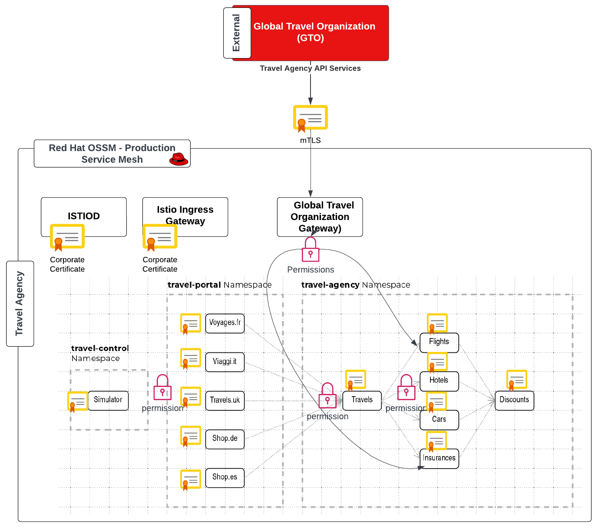
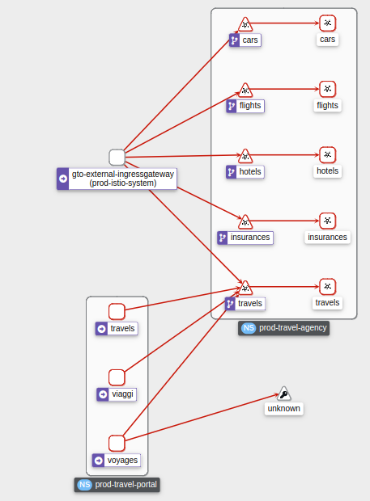
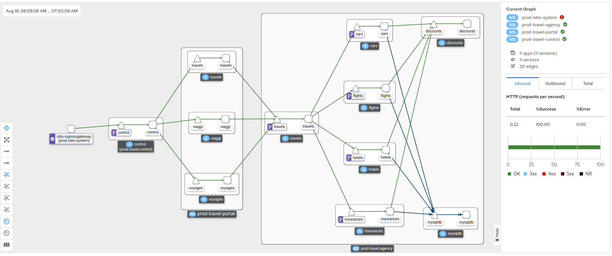

= Scenario 5 - Business Authz restrictions and Corporate CA Setup
:toc:

[IMPORTANT]
====
Before moving forward you should have fully completed *Lab Scenario-4*. If you have not done so, please do so now using if preferred the script `lab-4/complete-lab-4.sh`.
====

Evaluations by the Product Security Team as well as new regulations are requiring the Travel Agency company to further improve the security aspects of the running applications in production.

1. The Security Team requires a corporate (intermediate) CA certificate to be used for the inter-Service Mesh mTLS communications.
2. The Product Team (of the Travel Agency APIs) requires to add authorization for the access to specific services.

== Final Security Architecture Overview

== Task 1: Export Environment variables

[IMPORTANT]
====
As this is a multi-tenant cluster you should restrict use for this lab to the following namespaces associated with your user *`$LAB_PARTICIPANT_ID-prod-istio-system`*, *`$LAB_PARTICIPANT_ID-prod-travel-control`*, *`$LAB_PARTICIPANT_ID-prod-travel-portal`*, *`$LAB_PARTICIPANT_ID-prod-travel-agency`*

Export the following in the terminal of your choice (see link:../README.adoc[Lab Information] for values)

* export CLUSTER_CONSOLE=https://console-openshift-console.apps.<CLUSTER_NAME>.<DOMAIN_NAME>/
* export CLUSTER_API=https://api.<CLUSTER_NAME>.<DOMAIN_NAME>:6443/
* export LAB_PARTICIPANT_ID=<FROM 2nd column of THE TABLE below `userx`>
* export OCP_DOMAIN=apps.<CLUSTER_NAME>.<DOMAIN_NAME>
* export SSO_CLIENT_SECRET=bcd06d5bdd1dbaaf81853d10a66aeb989a38dd51
====

[NOTE]
====
If you are running out of time and wish to complete the following lab sections in a single step execute
----
cd lab-5
./complete-lab-5.sh $SSO_CLIENT_SECRET $OCP_DOMAIN $LAB_PARTICIPANT_ID
----
====

== Task 2: Disable STRICT MTLS for specific services

The Service Mesh of the Travel Agency company is configured to automatically use mTLS:

[source,yaml]
.Excerpt from the SMCP
----
spec:
  security:
    dataPlane:
      automtls: true
      mtls: true
----

but sometimes there is the requirement to exclude specific services from `OSSM` *mTLS*, i.e. if workloads offer their own mTLS certificates (see KAFKA, Elastic Search).

In addition if the SMCP configuration doesn't actually enforce mTLS, this can be done by configuring a `PeerAuthentication` resource.

[NOTE]
====
A `PeerAuthentication` resource defines how traffic will be tunneled (or not) to the sidecar proxy.
====

Although, it is not necessary for our use case to do so if at the end of the lab there is still time left you can try to `DISABLE`/`RE-ENABLE` the MTLS setting in the mesh for the `cars` service by following the instruction at link:scenario-5-optional.adoc[scenario-5-optional] in order to become familiar with this capability.

== Task 3: Applying default authorization policies

The Travel Agency company like any other business requires fine-grained _authorization_ policies to be applied. Openshift Service Mesh provides the capability to externalize this policies from the actual service code and the _Travel Agency_ `Mesh Operator` will implement them restricting access based on known _Best Practices_ and business requirements.

Further authorization capabilities are described in the `Istio` link:https://istio.io/latest/docs/tasks/security/authorization/[authorization documentation].

=== Step 1 - Verify current default AUTHZ is `ALLOW` all
The _Service Mesh_ default Authz policy is `ALLOW` all.

First lets verify that by default the _Service Mesh_ authorization policies allows all communications. The following table determines the expected allowed communications.

[cols="1,2,1,3"]
.Default policy is ALLOW all
|===
| Type of Policy | Namespaces | Client | Target

| ALLOW all | `prod-istio-system` -> `prod-travel-control` | Browser | `control.prod-travel-control`

| ALLOW all | `prod-istio-system` -> `prod-travel-agency` | `gto-external-ingressgateway` | `travels.prod-travel-agency`, `flights.prod-travel-agency`, `hotels.prod-travel-agency`, `insurances.prod-travel-agency`, `cars.prod-travel-agency`

| ALLOW all | `prod-travel-control` -> `prod-travel-agency` | `control.prod-travel-control` | `travels.prod-travel-agency`, `flights.prod-travel-agency`, `hotels.prod-travel-agency`, `insurances.prod-travel-agency`, `cars.prod-travel-agency`

| ALLOW all | `prod-travel-portal` -> `prod-travel-agency` | `viaggi.prod-travel-portal` | `travels.prod-travel-agency`, `flights.prod-travel-agency`, `hotels.prod-travel-agency`, `insurances.prod-travel-agency`, `cars.prod-travel-agency`

| ALLOW all | `prod-travel-agency` -> `prod-travel-agency` | `travels.prod-travel-agency` | `travels.prod-travel-agency`, `flights.prod-travel-agency`, `hotels.prod-travel-agency`, `insurances.prod-travel-agency`, `cars.prod-travel-agency`

|===

Let us verify the default communication paths described in the table above. Login as Mesh Operator with `emma/emma` and execute the following script:

[source,shell]
----
./login-as.sh emma

./check-authz-all.sh ALLOW user-$LAB_PARTICIPANT_ID-prod-istio-system $OCP_DOMAIN $SSO_CLIENT_SECRET $LAB_PARTICIPANT_ID
----

=== Step 2 - Apply best practice security pattern to `DENY` all

In the previous link:scenario-4.adoc[scenario-4] we applied an `AuthorizationPolicy` resource which allowed requests via the `gto-external-ingressgateway`. Now, we will utilize the `default-deny` pattern to DENY requests unless there is a specific `AuthorizationPolicy` allowing it.

As Mesh Operator with `emma/emma`  we apply the `default-deny` pattern to the prod-travel-agency namespace

[source,shell]
----
echo "apiVersion: security.istio.io/v1beta1
kind: AuthorizationPolicy
metadata:
  name: allow-nothing
  namespace: user-$LAB_PARTICIPANT_ID-prod-travel-agency
spec:
  {}" | oc apply -f -
----

and the prod-travel-control namespace:

[source,shell]
----
echo "apiVersion: security.istio.io/v1beta1
kind: AuthorizationPolicy
metadata:
  name: allow-nothing
  namespace: user-$LAB_PARTICIPANT_ID-prod-travel-control
spec:
  {}  " | oc apply -f -
----

=== Step 3 - Verify `DENY` all is applied

Now we can verify that no communications from the _Service Mesh_ are authorizated towards the _Travel Agency API_ Services or the _Travel Portal_.

[cols="1,2,1,3"]
.DENY ALL policy
|===
| Type of Policy | Namespaces | Client | Target

| DENY all | `prod-istio-system` -> `prod-travel-control` | Browser | `https://travel-prod-istio-system.apps.ocp4.rhlab.de/`

| DENY all | `prod-istio-system` -> `prod-travel-agency` | `gto-external-ingressgateway` | `travels.prod-travel-agency`, `flights.prod-travel-agency`, `hotels.prod-travel-agency`, `insurances.prod-travel-agency`, `cars.prod-travel-agency`

| DENY all | `prod-travel-control` -> `prod-travel-agency` | `control.prod-travel-control` | `travels.prod-travel-agency`, `flights.prod-travel-agency`, `hotels.prod-travel-agency`, `insurances.prod-travel-agency`, `cars.prod-travel-agency`

| DENY all | `prod-travel-portal` -> `prod-travel-agency` | `viaggi.prod-travel-portal` | `travels.prod-travel-agency`, `flights.prod-travel-agency`, `hotels.prod-travel-agency`, `insurances.prod-travel-agency`, `cars.prod-travel-agency`

| DENY all | `prod-travel-agency` -> `prod-travel-agency` | `travels.prod-travel-agency` | `travels.prod-travel-agency`, `flights.prod-travel-agency`, `hotels.prod-travel-agency`, `insurances.prod-travel-agency`, `cars.prod-travel-agency`

|===

Let us check the communication paths again:

[source,shell]
----
./check-authz-all.sh DENY user-$LAB_PARTICIPANT_ID-prod-istio-system $OCP_DOMAIN $SSO_CLIENT_SECRET $LAB_PARTICIPANT_ID
----

We can also login to Kiali and verify the traffic in the Dashboard:

=== Step 4 - Authz policy to allow Travel Dashboard UI access

Now after applying the DENY ALL policies, we open up only the required communication paths to make the applications work again.

Let us first login as Mesh Operator with `emma/emma` and check if we can access the Travel Dashboard. This should return a RBAC Access Denied error.

[source,shell]
----
./login-as.sh emma

curl -k https://travel-user-$LAB_PARTICIPANT_ID.$OCP_DOMAIN/

RBAC: access denied
----

Now create the following AuthorizationPolicies:

[source,shell]
----
echo "apiVersion: security.istio.io/v1beta1
kind: AuthorizationPolicy
metadata:
  name: authpolicy-istio-ingressgateway
  namespace: user-${LAB_PARTICIPANT_ID}-prod-istio-system
spec:
  selector:
    matchLabels:
      app: istio-ingressgateway
  rules:
    - to:
        - operation:
            paths: [\"*\"]" |oc apply -f -
----

and

[source,shell]
----
echo "apiVersion: security.istio.io/v1beta1
kind: AuthorizationPolicy
metadata:
  name: allow-selective-principals-travel-control
  namespace: user-$LAB_PARTICIPANT_ID-prod-travel-control
spec:
  action: ALLOW
  rules:
    - from:
        - source:
            principals: [\"cluster.local/ns/user-$LAB_PARTICIPANT_ID-prod-istio-system/sa/istio-ingressgateway-service-account\"]"|oc apply -f -
----

Please verify the access to the Travel Dashboard again. It should be accessible right now. You can also open the URL in your Browser:

[source,shell]
----
curl -k https://travel-user-$LAB_PARTICIPANT_ID.$OCP_DOMAIN/
----

=== Step 5 - Apply fine grained business Authz policies for service to service communications

In this last step, we'll create policies which will allow access

* from the gto-external-ingressgateway towards travels.prod-travel-agency, hotels.prod-travel-agency, cars.prod-travel-agency, insurances.prod-travel-agency, flights.prod-travel-agency in order to enable external partner requests
* for intra prod-travel-agency communications
* from prod-travel-portal to prod-travel-agency

Login as Mesh Developer with `farid/farid` and create the following AuthorizationPolicy:

[source,shell]
----
./login-as.sh farid

echo "apiVersion: security.istio.io/v1beta1
kind: AuthorizationPolicy
metadata:
 name: allow-selective-principals-travel-agency
 namespace: user-$LAB_PARTICIPANT_ID-prod-travel-agency
spec:
 action: ALLOW
 rules:
   - from:
       - source:
           principals: [\"cluster.local/ns/user-$LAB_PARTICIPANT_ID-prod-istio-system/sa/gto-user-$LAB_PARTICIPANT_ID-ingressgateway-service-account\",\"cluster.local/ns/user-$LAB_PARTICIPANT_ID-prod-travel-agency/sa/default\",\"cluster.local/ns/user-$LAB_PARTICIPANT_ID-prod-travel-portal/sa/default\"]" |oc apply -f -

----

Now let's login as Mesh Operator with `emma/emma` and verify the communication:

[source,shell]
----
./login-as.sh emma

./check-authz-all.sh 'ALLOW intra' user-$LAB_PARTICIPANT_ID-prod-istio-system $OCP_DOMAIN $SSO_CLIENT_SECRET $LAB_PARTICIPANT_ID
----

Please also login to Kiali and observe the communication flows:

== Task 4 (Optional): Use a custom Certificate Authority (CA)

In the Handbook

== Next Steps

Congratulations!!
You have completed Scenario 5.

link:scenario-6.adoc[Getting started with Scenario 6]
