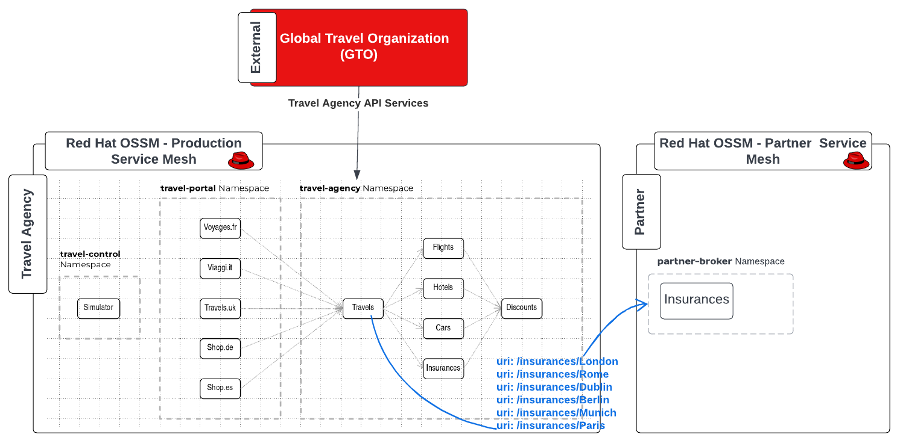

= Scenario 6 - Expanding Business Capabilities with Federation
:toc:

The Travel Agency has partnered with Premium Broker partner to diversify the insurance packages it offers to clients traveling to popular capital destinations.

== Requirements focused on new Business Partnership setup
1. The _Product Team_ (of the Travel Agency APIs) requires that all requests for insurance to destinations London, Rome, Paris, Berlin, Munich and Dublin will be forwarded to _Premium Insurance Broker_.
2. The _Security Team_ requires that all communications with the external partner services will adhere to mTLS based security.

The final Production Architecture will be

[NOTE]
====
The Lab Instructors have already created a second Service Mesh in `partner-istio-system` with tenant `partner` and dataplane namespace `premium-broker` where service `insurance` has been deployed
====

[WARNING]
====
*In a LAB Session with multiple participants do not execute the following as it can only be performed once for the whole group*
====

== Task 1: Setup federation between `production` and `partner` meshes

The 2 `SMCP` instances (production and partner) will be federated (link:https://docs.openshift.com/container-platform/4.9/service_mesh/v2x/ossm-federation.html#ossm-federation-config-export_federation[federation being a feature of Red Hat OSSM to connect services from multiple mesh instances]) and the `insurances` service from the partner mesh will be imported and used at the Travel Agency for the premium destinations. Below we have implemented this option.

[IMPORTANT]
====
Some important design practices when planning your service mesh federation include:

* Determine how many meshes is required to join in a federation. You probably want to start with a limited number of meshes.
* Decide on the naming convention to use for each mesh as having a pre-defined this will help with configuration and troubleshooting. It is helpful if the naming convention helps to determine who owns and manages each mesh, as well as the following federation resources:
** Cluster names
** Cluster network names
** Mesh names and namespaces
** Federation ingress gateways
** Federation egress gateways
** Security trust domains
====

The following script in a single step will

* Update the SMCP resource production to declare 2 additional gateways partner-mesh-egress and partner-mesh-ingress to connect for federation purposes to Service Mesh partner
* Update the SMCP resource partner to declare 2 additional gateways production-mesh-egress and production-mesh-ingress to connect for federation purposes to Service Mesh production
* Extract from each of the 2 meshes the configmap istio-ca-root-cert and share it on the controlplane namespace of the opposite federated mesh required for the TLS handshake.
* Create partner ServiceMeshPeer resource in prod-istio-system to initiate the peering production → partner mesh.
* Create production ServiceMeshPeer resource in partner-istio-system to initiate the peering partner → production mesh.
* Export the insurances service (via ExportedServiceSet) from premium-broker namespace and import it (via ExportedServiceSet) into prod-travel-agency namespace.

----
cd lab-6
./login-as <ADMIN>
./execute-federation-setup.sh user-$LAB_PARTICIPANT_ID-prod-istio-system user-$LAB_PARTICIPANT_ID-production partner-istio-system partner premium-broker $LAB_PARTICIPANT_ID
----

== Task 2: Route requests to Premium Insurance Broker partner

The outcome of this configuration will be that insurance quotes requests arriving at prod-travel-agency/travels service will be forwarded to federated insurances.premium-broker.svc.partner-imports.local service.

----
./apply-federated-traffic-connectivity.sh user-$LAB_PARTICIPANT_ID-prod-istio-system user-$LAB_PARTICIPANT_ID-production partner-istio-system partner premium-broker $LAB_PARTICIPANT_ID
----

